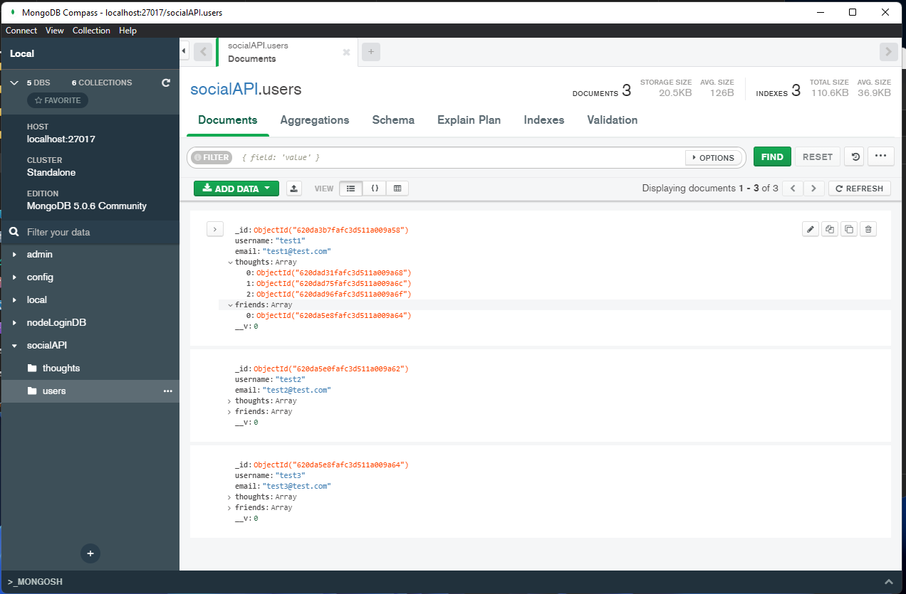

# socialNetworkApi

 

 ## Description

_Welcome to Social network API! This application was created with MongoDB, Node.js, using express, and Mongoose packages._ 

This application:
* is ran from the back-end and does not have a deployed page however, it can be ran on the command line and database changed through insomnia!

---

  ## Table of Contents
  
  - [Usage](#usage)
  - [Installation](#installation)
  - [Walk-through video](#walk-through)
  - [Screenshots](#screenshots)
  - [License](#license)
  - [Contributions](#how-to-contribute)
  - [Questions](#questions)

  ---

  ## Usage
Use this how you see fit to save information onto the database! 

Currently this application is able to:
* Create, read, update and delete a User
* Add and delete a friend to user
* Create, read, update and delete a Thought
* Add and delete a reaction to the thoughts
* Newly added functionality-Deleting users associated thoughts and deleting user from associated Users friends list

---

  ## Installation

This project is ran through Node.js, clone the repo and install the required dependencies with npm. 

  ---

  ## Walk-through

Here is a link to the walk through video to show functionality of the application

Coming soon!

[link to whole video]( "Whole walkthrough video")

  ---

  ## Screenshots

Here are some screen shots of this application.

    

  ---

  ## License

   MIT License

Copyright (c) [2022] [Amber Robeck]

Permission is hereby granted, free of charge, to any person obtaining a copy
of this software and associated documentation files (the "Software"), to deal
in the Software without restriction, including without limitation the rights
to use, copy, modify, merge, publish, distribute, sublicense, and/or sell
copies of the Software, and to permit persons to whom the Software is
furnished to do so, subject to the following conditions:

The above copyright notice and this permission notice shall be included in all
copies or substantial portions of the Software.

THE SOFTWARE IS PROVIDED "AS IS", WITHOUT WARRANTY OF ANY KIND, EXPRESS OR
IMPLIED, INCLUDING BUT NOT LIMITED TO THE WARRANTIES OF MERCHANTABILITY,
FITNESS FOR A PARTICULAR PURPOSE AND NONINFRINGEMENT. IN NO EVENT SHALL THE
AUTHORS OR COPYRIGHT HOLDERS BE LIABLE FOR ANY CLAIM, DAMAGES OR OTHER
LIABILITY, WHETHER IN AN ACTION OF CONTRACT, TORT OR OTHERWISE, ARISING FROM,
OUT OF OR IN CONNECTION WITH THE SOFTWARE OR THE USE OR OTHER DEALINGS IN THE
SOFTWARE.

  
  ---
  
  ## How to Contribute

     However you would like to contribute I always look forward to learning something new, feel free to email me!

  [Contributor Covenant](https://www.contributor-covenant.org/)

  ---

  ## Questions

https://img.shields.io/badge/Gmail-D14836?style=for-the-badge&logo=gmail&logoColor=white

  Contact me here:   arr5533@gmail.com

* OR here

 [Amber Robeck](https://github.com/Amber-Robeck)

* OR here

